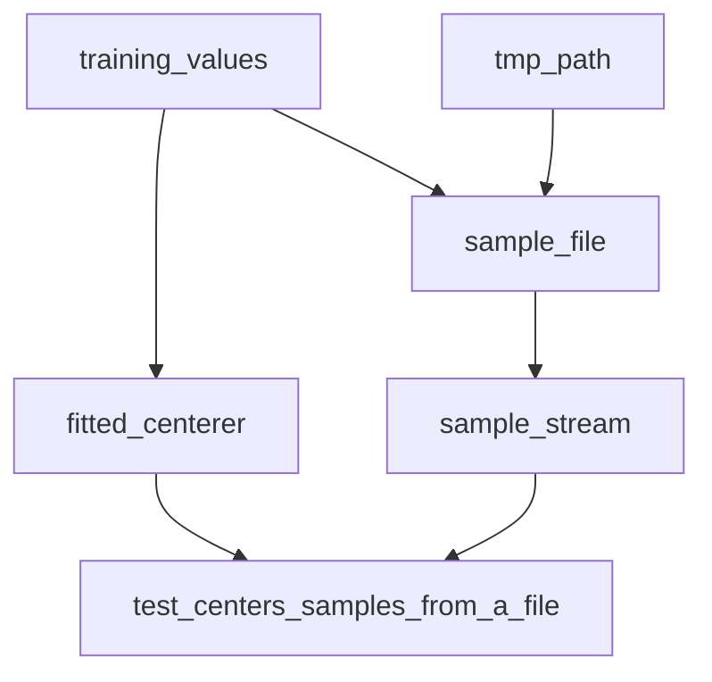

# Testing with pytest

[Project overview and reading path](../README.md)

Static types constrain the programs you can write; tests exercise the behavior of
the programs that remain. A centerer that adds its mean instead of subtracting it
can be perfectly well typed. For training values `(2.0, 4.0, 6.0)`, the mean is
`4.0`, so transforming `7.0` must produce `3.0`, not `11.0`. That is a behavioral
assertion, not an assignability check.

Python's dynamic boundaries make this distinction especially important. Rust also
needs tests; neither compiler nor type checker proves an algorithm is correct.
Use pytest for numerical behavior, failure contracts, mutation, resource lifetime,
and integration. Keep static rejection tests for the separate claims about what
Pyrefly prevents.

## Choose the smallest test that establishes the contract

| Kind of test | Question | Example in this repository |
| --- | --- | --- |
| Static rejection | Does a forbidden operation fail checking for the intended reason? | Reading a nonexistent key from typed job configuration |
| Unit behavior | Does this operation produce the right observable result? | Centering `7.0` around `4.0` produces `3.0` |
| Boundary/contract | Does a component honor validation, failure, and mutation promises? | Rejecting malformed SDK output and preserving the request |
| Integration | Do a few real components work together? | Reading a temporary file and applying fitted preprocessing |

Test public behavior, not every helper or internal call. A useful failure tells
you which contract broke. Multiple assertions are fine when they establish one
behavior, such as returning the correct prediction **and** leaving its input
unchanged. Avoid rebuilding the production algorithm inside the expected-value
calculation; use a hand-computed case or an independent reference.

## `conftest.py`: share setup where it is needed

The runnable lesson contains three files:

| File | Responsibility |
| --- | --- |
| [conftest.py](../tests/pytest_patterns/conftest.py) | Shared setup and resource lifetimes for this directory |
| [test_centering.py](../tests/pytest_patterns/test_centering.py) | Parametrized transformation and validation behavior |
| [test_file_samples.py](../tests/pytest_patterns/test_file_samples.py) | A test using both branches of the fixture graph |

Pytest discovers `conftest.py`; tests request fixtures through function arguments.
Do not import or call fixture functions. Keep fixtures used by one module there;
move shared ones to the nearest common test directory's `conftest.py`. Its fixtures
are available to tests in that directory and descendants, not arbitrary sibling
directories. Keep pure helpers and domain types in ordinary modules.
[Pytest fixture visibility](https://docs.pytest.org/en/stable/reference/fixtures.html).

[Source](../tests/pytest_patterns/conftest.py)

```python
"""Share a small dependency graph of setup resources within this test directory."""

from collections.abc import Iterator
from pathlib import Path
from typing import TextIO

import pytest

from examples.preprocessing_state import FittedCenterer, UnfittedCenterer


@pytest.fixture
def training_values() -> tuple[float, ...]:
    """Provide a small, deterministic training set with a hand-checkable mean."""
    return (2.0, 4.0, 6.0)


@pytest.fixture
def fitted_centerer(training_values: tuple[float, ...]) -> FittedCenterer:
    """Fit the shared training values for tests of subsequent transformation."""
    return UnfittedCenterer().fit(training_values)


@pytest.fixture
def sample_file(tmp_path: Path, training_values: tuple[float, ...]) -> Path:
    """Write one scalar per line in pytest's isolated temporary directory."""
    path = tmp_path / "samples.txt"
    path.write_text("\n".join(str(value) for value in training_values) + "\n")
    return path


@pytest.fixture
def sample_stream(sample_file: Path) -> Iterator[TextIO]:
    """Lend an open stream to one test and close it even if that test fails."""
    with sample_file.open(encoding="utf-8") as stream:
        yield stream
```

## Fixtures depend on fixtures: let pytest build the graph

`fitted_centerer` requests `training_values`. `sample_file` requests both
`training_values` and the built-in `tmp_path`. `sample_stream` requests `sample_file`.
The test asks for its two immediate dependencies; it does not orchestrate their
construction.



This is often called a fixture tree, but shared dependencies make it a directed
acyclic graph. Here pytest evaluates `training_values` once for the test and shares
the returned value between both branches. The default function scope creates fresh
setup for the next test. Dependencies establish order; file order and parameter
order are not a reliable substitute for declaring them.
[Fixture dependency ordering](https://docs.pytest.org/en/stable/reference/fixtures.html).

[Source](../tests/pytest_patterns/test_file_samples.py)

```python
"""Consume two fixture branches without importing or manually calling fixtures."""

from typing import TextIO

import pytest

from examples.preprocessing_state import FittedCenterer


def test_centers_samples_from_a_file(
    fitted_centerer: FittedCenterer, sample_stream: TextIO
) -> None:
    """Transform a real temporary-file stream using the fitted component."""
    samples = tuple(float(line) for line in sample_stream)
    actual = tuple(fitted_centerer.transform(value) for value in samples)
    assert actual == pytest.approx((-2.0, 0.0, 2.0), abs=1e-12)
```

Keep the operation being tested visible in the test. The fitted object is setup
for a transformation test; calling `transform` is the action. If the subject is
fitting itself, call `fit` in the test rather than hiding it in a fixture that
returns the final expected answer.

## Scope and cleanup are part of the design

Start with function-scoped fixtures. Broader scopes trade isolation for reuse;
reserve them for safely shared, expensive resources. A mutable model, optimizer,
iterator, or database transaction can leak state if shared across tests. An
immutable lookup table is a different case. A session-scoped fixture cannot depend
on a function-scoped fixture such as `tmp_path`; lifetimes must be compatible.

The stream fixture yields inside a context manager, so it closes after the test
even if an assertion fails. Put cleanup responsibility beside resource acquisition.
If a fixture fails before reaching `yield`, its code after `yield` does not run;
use context managers or carefully registered finalizers for resources already
acquired. Keep resource fixtures small enough to reason about partial setup.
[Fixture scope and teardown](https://docs.pytest.org/en/stable/how-to/fixtures.html).

Use built-ins instead of recreating their infrastructure: `tmp_path` for isolated
files, `monkeypatch` for temporary environment/attribute changes, and `capsys` or
`caplog` for observable output. Prefer explicit fixture dependencies over `autouse`
for ordinary setup. If `autouse` enforces a suite-wide rule, keep its scope narrow
and its effect documented.

## Parametrize behavior, including failure cases

Use `@pytest.mark.parametrize` when the same contract applies to several inputs.
Each case becomes a separately reported test. Give meaningful IDs so a failure
identifies the scenario rather than only its position in a list.

[Source](../tests/pytest_patterns/test_centering.py)

```python
"""Parametrize observable behavior while pytest provides shared typed setup."""

import pytest

from examples.preprocessing_state import FittedCenterer, UnfittedCenterer


@pytest.mark.parametrize(
    ("value", "expected"),
    [
        pytest.param(1.0, -3.0, id="below-training-mean"),
        pytest.param(4.0, 0.0, id="at-training-mean"),
        pytest.param(7.0, 3.0, id="above-training-mean"),
    ],
)
def test_centers_with_fitted_statistics(
    fitted_centerer: FittedCenterer, value: float, expected: float
) -> None:
    """Center each input using training statistics, including the zero result."""
    actual = fitted_centerer.transform(value)
    assert actual == pytest.approx(expected, abs=1e-12)


@pytest.mark.parametrize(
    "samples",
    [
        pytest.param((), id="empty"),
        pytest.param((float("nan"),), id="nan"),
        pytest.param((float("inf"),), id="infinite"),
    ],
)
def test_fit_rejects_invalid_training_values(samples: tuple[float, ...]) -> None:
    """Reject well-typed values that violate the fitting preconditions."""
    with pytest.raises(ValueError, match="nonempty and finite"):
        UnfittedCenterer().fit(samples)
```

In the first test, `value` and `expected` come from parametrization;
`fitted_centerer` comes from fixture resolution. The second test checks values that
have the correct Python type but violate fitting preconditions. Keep only the
operation expected to fail inside `pytest.raises`; use the expected exception class
and match a stable part of the message when that is part of the API contract.
[Pytest assertions and exceptions](https://docs.pytest.org/en/stable/how-to/assert.html).

Pytest passes parameter objects as supplied, without making copies. Prefer immutable
case data; construct mutable inputs per test. Do not mutate a shared parameter and
expect a later case to start clean. Stacked parametrization forms a Cartesian
product, so use it only when every combination is meaningful. Use indirect
parametrization when values genuinely configure a fixture's setup, not as the
default for ordinary input/output cases.
[Parametrization behavior](https://docs.pytest.org/en/stable/how-to/parametrize.html).

## Type-check the tests, but understand fixture injection

Annotate fixture return types and test parameters. A yielding fixture has an
iterator return type, such as `Iterator[TextIO]`, while its consumer receives
`TextIO`. These annotations let Pyrefly check operations inside each function.

Pytest resolves fixtures **by name**, not by annotation. Do not assume Pyrefly
proves that a test parameter's annotation matches the fixture pytest will select,
or that every value in a parametrization decorator matches its parameter annotation.
Running the suite is still required. An importable, annotated test is not evidence
that pytest collected or executed it.

## Test doubles and scientific code

Inject a small fake at the dependency boundary when a test should not require a
network, GPU, wall clock, or external account. Let the fake implement the same small
protocol as the real adapter, and reuse behavioral contract cases where possible.
Do not mock the operation you are claiming to test and then assert that the mock
returned its configured value. Keep separate integration tests for the real
adapter where the environment supports them.

For numerical code, use small values with known answers, choose tolerances based on
the algorithm and precision, and test edge cases such as zero, empty inputs, masks,
and nonfinite values where relevant. `pytest.approx` is useful for scalar/sequence
comparisons; tensor code should use its framework's comparison tools and intentional
tolerances. A shape assertion alone does not establish correct values or gradients.

Control random generators locally, or inject them. A global seed does not by itself
guarantee reproducibility across devices and nondeterministic kernels. Prefer small
deterministic unit tests, with larger integration or statistical tests separately
identified. A full training run is rarely the smallest evidence for a local bug fix.

## Anti-patterns and their replacements

| Anti-pattern | Why it fails | Prefer |
| --- | --- | --- |
| `fitted_centerer(training_values)` inside a test | Calls a fixture as if it were an ordinary factory; bypasses pytest's lifecycle model | Request `fitted_centerer` as a test argument |
| `from conftest import fitted_centerer` | Couples tests to discovery internals and encourages direct calls | Let pytest discover fixtures; import ordinary helpers from normal modules |
| One giant fixture with a dozen unrelated resources | Hides dependencies and makes failures hard to localize | Small fixtures composed through named arguments |
| A session-scoped mutable model or shared consumed iterator | Tests affect later tests through hidden state | Function scope, or explicit reset/isolation when reuse is required |
| Unrelated `autouse` setup everywhere | A test's visible dependencies stop explaining its environment | Explicit injection for ordinary setup |
| Loops over cases inside a test | One failure obscures subsequent cases and reporting | Parametrize distinct scenarios with useful IDs |
| Mutating parameter lists or dictionaries | Case objects may be shared; later cases inherit changes | Immutable parameter records and fresh mutable working data |
| `pytest.raises(Exception)` around a large block | An unrelated bug can satisfy the test | The specific expected exception around the smallest operation |
| Reimplementing the algorithm to calculate expected output | The test can reproduce the same mistake | Independent expected values or reference implementation |
| Mocking private implementation details | Refactoring breaks tests even when behavior is unchanged | Assert outputs, state transitions, and boundary contracts |
| Real network calls, sleeps, or uncontrolled randomness in unit tests | Tests become slow, flaky, and environment-dependent | Inject fakes, controlled clocks/generators, and explicit integration tests |
| Testing only that code did not raise | Incorrect but plausible output passes | Assert the relevant result and invariants |
| Treating coverage percentage as correctness | Executed lines may have no meaningful assertions | Check contracts and likely failure modes; use coverage to find omissions |
| Hiding a failure with blanket skip/xfail | A regression can disappear indefinitely | A concrete reason and removal condition; strict xfail when unexpected success should fail |

Fixtures are not a requirement for every constant or pure expression. Use them for
reusable setup and managed resources; use parametrization for cases, and ordinary
functions for pure helpers. The aim is a dependency graph the reader can understand,
not a miniature framework inside the test suite.

## Run and inspect the runnable lesson

```sh
uv run --locked pytest tests/pytest_patterns
uv run --locked pytest tests/pytest_patterns --setup-show
uv run --locked pytest tests/pytest_patterns --collect-only -q
```

The first runs the lesson, the second shows fixture setup/teardown, and the third
shows collected cases without executing them. The full suite also verifies that
these documentation snippets match the actual test files. Pyrefly and Ruff check the
fixtures and tests alongside application examples.

The project's pytest configuration rejects unknown configuration options and
unregistered markers. Expected failures are strict by default: an unexpected pass
fails the suite so a stale `xfail` cannot silently remain. Register any new custom
markers in `pyproject.toml` and give expected failures a concrete reason.

The practical rule is: **types describe permitted operations; fixtures establish
test conditions; parametrization explores cases; assertions check the behavior.**
Keep each responsibility visible.
